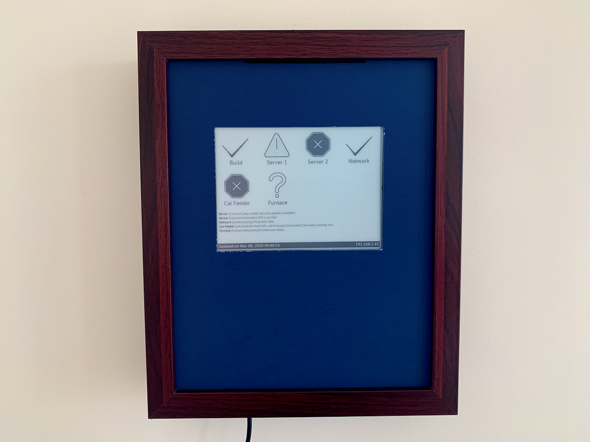
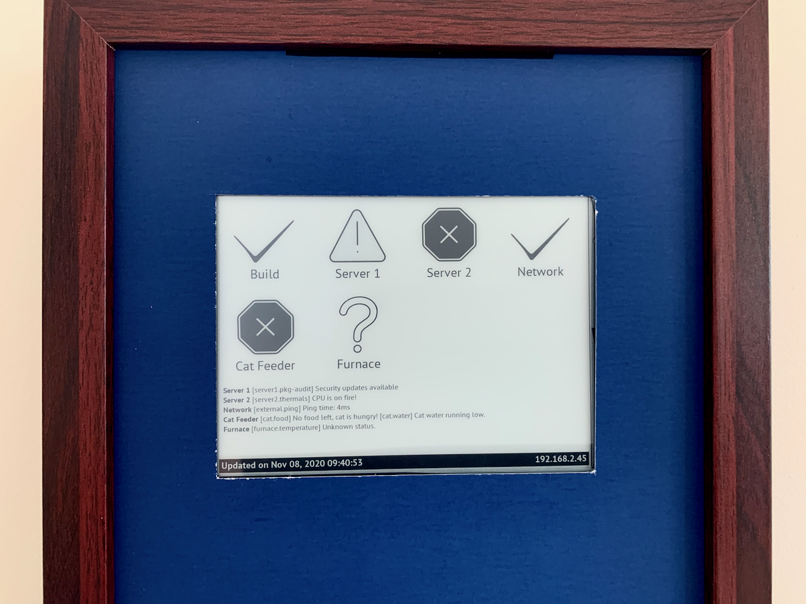
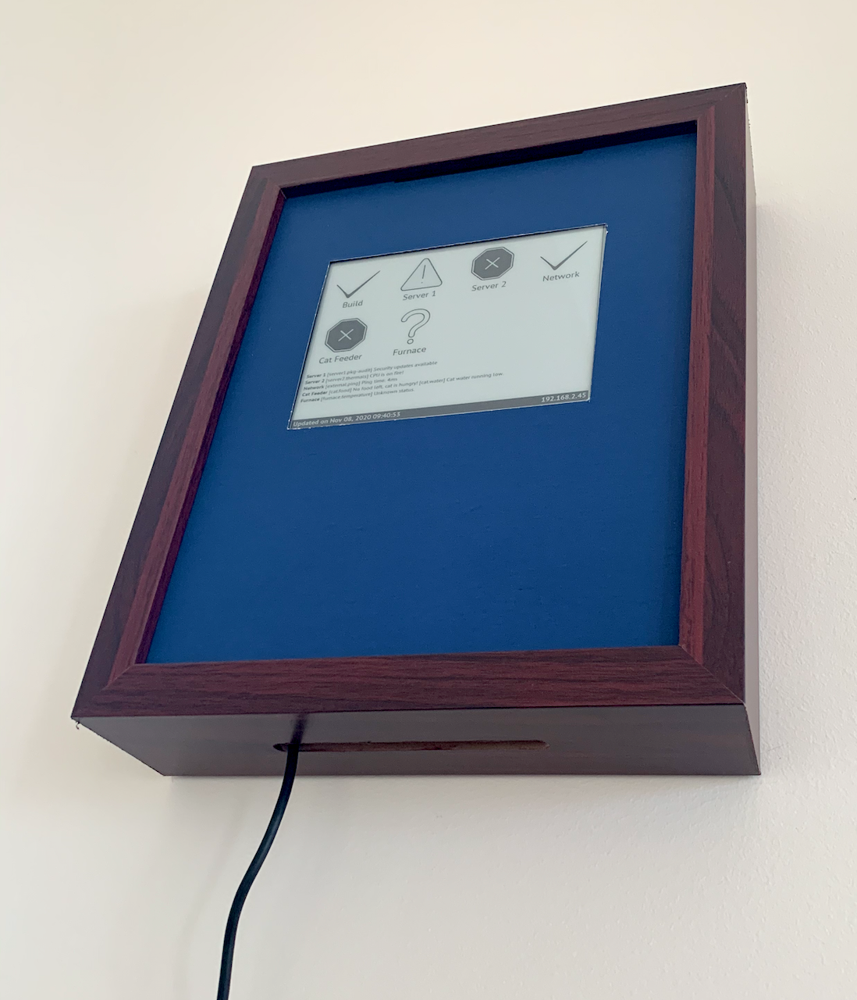
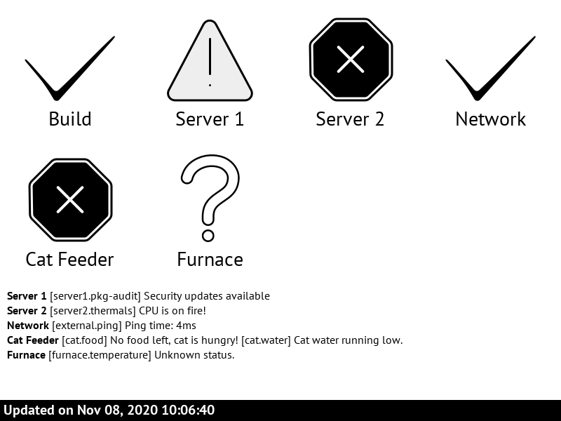

# epaperboard
epaperboard is a Python app to build a dashboard using a Raspberry Pi and an e-paper (aka e-ink) display! You can
use it as is if it suits your needs, or use this project as a starting point to build a dashboard more suitable for
your use case.





Why e-paper? Two main reasons:

* It doesn't emmit light, so I can have this in my living room without being disturbing at night;
* I love the grayscale aesthetics these displays provide!

*Please note different parts of this project are distributed under two different licenses. You can find more
details near the end of this file.*

# Requirements

## Hardware

This app should work with any Raspberry Pi board with a GPIO header and any Waveshare e-paper display 
with a parallel interface using the IT8951 HAT. Mind that not all Waveshare e-paper displays use that driver.
If you have a SPI display that connects to the Raspberry Pi through the SPI pins or the simpler passive HAT,
you need to write a display adapter.

Here's what I'm using:

* [Raspberry Pi 3](https://www.raspberrypi.org/products/raspberry-pi-3-model-b/?resellerType=home)
* [Waveshare 800x600, 6inch E-Ink display HAT](https://www.waveshare.com/product/raspberry-pi/displays/e-paper/6inch-e-paper-hat.htm)
* (optional) [8x10 Shadow Box with Slot](https://www.amazon.ca/gp/product/B07YCHSDLN/)

Any Raspberry Pi model with a GPIO header should work. Any e-paper display with a IT8951 should also work, but
you will need to adjust the drawing code to the resolution of the display you're using. This specific model gives
you 16 levels of grayscale.

The easiest way to wire the display to the Raspberry Pi is to plug the HAT directly to the GPIO headers, but
you may also use the SPI cable provided with the display to connect it directly to the SPI pins. This may be
useful if you're using a Pi Zero W, which does not come with the header pins soldered.

I also got a shadow box to use as an enclosure. If you choose (or print) an enclosure for your dashboard,
keep in mind the Pi with the HAT is bulky, especially due to the headers the HAT comes with for programming
the driver chip. The one linked above is just deep enough to fit everything inside. I used tape to stick the
display to the front glass and some spacers to screw the raspberry pi to the back. Finally, a blue poster board
is covering the glass to block the light from the LEDs inside (the HAT has a "power" LED, and the Pi has another one).

The box has a top slot for collecting postcards. I've installed it upside down, and I'm using the slot to pass the
USB cable that's powering the Raspberry Pi.

As a side note, the screen is not totally opaque, and at night I can still see a faint red glow from the LED behind
the screen. If you want to block all light coming from the electronics, you need to cover the back of the screen with
some material to block the light.

## Software

You'll need:

* Python 3.7 or newer, which comes pre-installed with the Raspberry Pi OS. I'm using 3.7.3 without issues.
* [Greg Meyer's IT8951 Python library](https://github.com/GregDMeyer/IT8951). This awesome Python library talks to
the driver HAT through its serial protocol and provides a very simple API to work with the Waveshare display. Follow
the instructions on the project page to install it.
* pip3 to install both Greg's library and the app.

# Installation

1. Install the following packages. The first one is a library needed by `pillow` that's missing and would cause
a runtime error if not installed. The second one is the Pypi package manager.

```
sudo apt-get install libopenjp2-7
sudo apt-get install python3-pip
```

2. Follow the instructions on [Greg's IT8951 library page](https://github.com/GregDMeyer/IT8951) to install it.
Note you need to use `pip3` instead of `pip`. As the page mentions, make sure you enable SPI with `raspi-config`.

3. Checkout this repository to a directory somewhere in your Raspberry pi, `cd` into it and run `pip3 install .`:

```
git clone https://github.com/arroz/epaperboard
cd epaperboard
pip3 install .
```

The app is now installed in your home directory. If you are in a graphical environment, you can test the app
immediately by running the following command:

```
epaperboard example/config.json
```

This is the app running in `dev` mode, where, instead of using an actual e-paper screen, the image is drawn
to a file and presented in a window. You can use this mode to run the application on a different platform,
like a Mac or Windows, while developing (you don't need to install the IT8951 library on a development machine, as
you'll not be using any e-paper display).

You should be looking at a window with 6 big question marks, and a few lines of text in the bottom. Let's make it
more interesting and issue a few requests. In a different terminal window, `cd` into the `epaperboard` directory and
run the following:

```
sh example/requests.sh
```

After the requests finish, you should see an image like the following:



This is how you interact with the app: through HTTP requests changing the value of keys that,
when composed, define the state of an entry in the screen.

# Configuration

To use the app with an actual e-paper display, you need to make two changes in the configuration file. I recommend
you copy the file to a different location and work with the copy, to avoid overwriting your changes and avoid conflicts
the next time you fetch from the git remote.

1. Change the `drawing_adapter_type` from "DEV" to "EPD":

```
"drawing_adapter_type": "EPD"
```

2. You need to tell the application the VCOM value of your display. This value is printed on a label that can be
found attached to the flat cable. This value is different, depending on the manufacturing batch, so I cannot provide
a default value, at the risk of damaging your display. The [display manual](https://www.waveshare.com/w/upload/2/23/6inch_e-Paper_HAT_User_Manual_EN.pdf)
points you to the correct label (see page 9). As an example, mine is -2.06. Note the value is negative, and you need
to include the `-` signal. **Keep in mind using the wrong value here may cause permanent damage to your display!**

After you know the value, add a new key to the configuration file. For example, if the VCOM value of your display is
-2.06, like mine, add the following line:

```
  "epd_vcom": -2.06
```

So your config file would look something like this:

```
{
  "server_port": 8080,
  "data_file_path": "/tmp/entries.json",
  "drawing_adapter_type": "EPD",
  "epd_vcom": -2.06,
  "dashboard": [
    …
  ]
}
```

Assuming you're running on a Raspberry Pi with the display HAT attached and wired up properly, if you run the
application as described above, and the example requests, you should now see the dashboard running in your display.
Congratulations!

To make it useful for you, you need to configure the dashboard object of the config file. You can add up to 8 entries.
Each entry must have a title (short, so it fits under the icon; the application will crash if the title is too long),
a "time to live" (TTL) in seconds, and a list of one or more unique keys.

The TTL defines how much time can go by between updates before we consider the value "unknown" (and display the
question mark icon). Use 0 for keys that don't have a TTL.

The keys allow you have several "probes" for each entry. You can see several examples in the provided config file.

# Requests

There are 3 types of HTTP requests you can perform. All the requests must use the POST method. The app will show the
IP your Raspberry Pi is using on the bottom right corner, and the port is the one defined in the first line of the
config file.

```
curl -d 'state=CRITICAL' -d 'message=No food left, cat is hungry!' http://localhost:8080/entry/cat.food
```

The `entry/<key>` updates a key with the provided state and optional message. The state can be one of the following:
`OK`, `WARNING`, `CRITICAL` and `UNKNOWN`. The message, if provided, will be displayed on the bottom third of the
display. The screen will only be redrawn if the state of this or any other key changes.

```
curl -x POST http://localhost:8080/update
```

This updates the screen if anything changed (specifically, if the TTL of any key expired). The app will **not** update
the screen automatically when that happens, only when a request arrives. If you don't have any script running requests
frequently enough, it's recommended that you configure the cron to issue an update request every minute.

```
curl -x POST http://localhost:8080/redraw
```

Causes the screen to redraw. Unlike the previous two requests, that only draw if any key changed its state, this
request will *always* redraw the screen.

By creating a config file defining what you want to monitor, and writing scripts to issue HTTP requests, you can
monitor anything! From the most complex server deployments to Arduino boards with WiFi chips, or wireless and USB
sensors talking to this or another Raspberry Pi on the same network, your imagination is the limit.

# Security

The built in web server provides no authentication nor SSL. Essentially, anything in your network can talk to it.
If you need SSL or authentication, you will have to implement those changes yourself.

An important note if you want to perform such modifications: one reason I'm using [Bottle](https://bottlepy.org/docs/dev/)
as a server, aside from its simplicity, is the fact it's single threaded. Although for most uses this would be
a showstopper, for epaperboard it's actually great. No two things can be drawing to the screen at the same time,
so there's no point in dealing with multi-threading. Although I added a lock to the EPD adapter to make really
sure the access to the display is single threaded, nothing else in the application is thread safe. So, if you
decide to replace the web server, you will need to handle thread-safeness across the entire application as well. 

# License

This project is distributed under the [MIT License](https://github.com/arroz/epaperboard/blob/main/LICENSE), except
for the bundled fonts which are distributed under the [OFL License](https://github.com/arroz/epaperboard/blob/main/epaperboard/fonts/OFL.txt).
The font license and copyright attribution are included in the OFL.txt file in the fonts directory. It's your
responsibility to read and understand both licenses and decide if they are valid for your intended usage of this
software.
